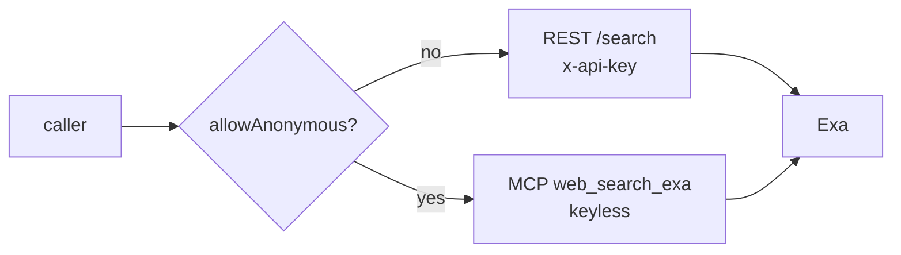

# um-dsh-websearch

**English** · [简体中文](./README.md)


An Exa (exa.ai) web search provider that registers a `WebSearchProvider` into the DeepSeek
Harness `ctx.web` seam. Shaped after the official `@deepseek-ai/dsh-web-search-deepseek`,
plus a **dynamic `enabled` switch** and a **bilingual settings card**.

## Features

- **Two transports** — authenticated REST `/search` or keyless anonymous MCP
  (`web_search_exa`), selected by configuration
- **Dynamic switch** — `enabled` ships off; flip it in Settings and the next search
  picks it up live, no restart
- **Flexible credential resolution** — literal key → credentials-service reference →
  launch environment, with fallback; anonymous mode bypasses keys entirely
- **Live availability** — `available()` is computed from the current configuration, so
  the selector reflects switch and endpoint changes immediately
- **Bilingual UI** — the settings card follows the DSH UI language (English / 简体中文)
  in real time

## Quick start

Mount into profile `web` in two steps:

```powershell
pnpm exec dsh plugin --profile web add <path-to-this-repo>
```

Append to the top-level list of `$DSH_HOME/profiles/web/cordis.patch.yml`:

```yaml
- insert:
    - id: web-search-exa
      name: um-dsh-websearch
```

Restart DSH, then enable the provider at **Settings → Plugin Config → Exa Web Search**.

## Configuration

| Key | Default | Meaning |
|---|---|---|
| `enabled` | `false` | Dynamic switch; when off the provider stays registered but unusable |
| `allowAnonymous` | `false` | Keyless mode: searches go through Exa's public hosted MCP |
| `apiKey` | omitted | Literal key (secret) that wins over the reference when non-empty; REST mode only |
| `apiKeyEnv` | `EXA_API_KEY` | Credentials-service reference (an environment variable name); the key never lands in the settings document |
| `baseURL` | `https://api.exa.ai` | REST base; `/search` is appended; `EXA_BASE_URL` overrides |
| `mcpBaseURL` | `https://mcp.exa.ai/mcp` | Anonymous MCP endpoint; point it at a self-hosted proxy if needed |
| `numResults` | `5` | Default result count (1–10) when a search carries no `maxResults` |
| `searchType` | `auto` | `auto` / `neural` / `keyword` (REST mode only) |

Base-layer example (the settings page renders it as the `base` layer; user layers
override it):

```yaml
- id: web-search-exa
  name: um-dsh-websearch
  config:
    apiKeyEnv: EXA_API_KEY
    searchType: neural
```

Any field change takes effect on the next search (live-reload): the provider projects
the section per call, so the selector never flickers on endpoint or mode changes.

### Switch the default search backend to Exa

```yaml
- id: web
  name: "@deepseek-ai/dsh-web"
  config:
    searchProvider: exa
```

Restart once after appending. Rollback = remove the override and the insert row above.

## How it works

Every search resolves an options snapshot from the **current** configuration, then
dispatches by mode:



The authenticated path posts to `{baseURL}/search` (honoring `searchType`); the anonymous
path performs the MCP `initialize` handshake and calls the `web_search_exa` tool. Results
are deduplicated by URL; the provider emits no `content`. Failures surface as `WebError`
codes: `WEB_PROVIDER_CREDENTIAL_MISSING` (no key) · `WEB_PROVIDER_ERROR` (HTTP / parse
failure) · `WEB_ABORTED` (caller cancellation).

### Known limitations

- Anonymous-mode availability only checks that `mcpBaseURL` parses; endpoint reachability
  is not probed (`available()` is a synchronous contract)
- The anonymous channel builds snippets from returned Highlights text — no `text` /
  `summary` structure is available there
- `searchType` applies to the REST channel only; the anonymous MCP search semantics are
  decided by Exa's hosted service

## Troubleshooting

<details><summary>Composition checks · exports gate · common issues</summary>

- Verify the composition: `pnpm exec dsh --profile web --dump-config | Select-String exa`
- Client-half presence: after restart, `GET http://127.0.0.1:3080/plugins/um-dsh-websearch/client.js`
  should return the module; a 404 means the package was not scanned
- **exports gate**: the client-modules scanner calls `require.resolve("<package>/package.json")` —
  your `exports` map must explicitly allow `"./package.json"`, otherwise
  `ERR_PACKAGE_PATH_NOT_EXPORTED` is silently swallowed and the client half never enters
  the graph
- Architecture decision record: [ADR-0001 — Exa web search integration](.um.agents/constraints/ADR-0001-web-search-exa.md)

</details>

## Documentation

[DeepSeek Harness · Your first plugin](https://deepseek-harness.github.io/deepseek-harness/en/develop/basic/) ·
[Bundling & installing plugins](https://deepseek-harness.github.io/deepseek-harness/en/develop/basic/publish)

## License

MIT © 2026 [UnforgetMemory](https://github.com/UnforgetMemory)