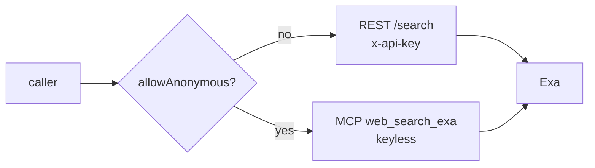

# um-dsh-websearch

**简体中文（默认）** · [English](./README.en.md)


Exa（exa.ai）网页搜索提供方，为 DeepSeek Harness 的 `ctx.web` seam 注入一个 `WebSearchProvider`。
产品形态对齐官方 `@deepseek-ai/dsh-web-search-deepseek`，并内置**动态开关**与**中英双语设置卡片**。

## 特性

- **双传输通道** — 认证 REST `/search` 或免密钥匿名 MCP（`web_search_exa`），按配置自动切换
- **动态开关** — `enabled` 出厂关闭；设置页一键开启，下一次搜索即热生效，无需重启
- **凭据灵活解析** — 字面密钥 → 凭据服务引用 → 启动环境变量逐级回退；匿名模式密钥整体不参与
- **实时可用性** — `available()` 按当前配置实时计算，选择器即时反映开关与端点变更
- **双语界面** — 设置卡片跟随 DSH 界面语言（简体中文 / English）实时切换

## 快速开始

以 profile `web` 为例，两步挂载：

```powershell
pnpm exec dsh plugin --profile web add <本仓库路径>
```

在 `$DSH_HOME/profiles/web/cordis.patch.yml` 顶层列表追加：

```yaml
- insert:
    - id: web-search-exa
      name: um-dsh-websearch
```

重启 DSH。到 **设置 → 插件配置 → Exa 网页搜索** 打开 `enabled` 即可使用。

## 配置

| Key | Default | Meaning |
|---|---|---|
| `enabled` | `false` | 动态开关；关闭时 provider 注册但不可选 |
| `allowAnonymous` | `false` | 匿名模式：走 Exa 公开托管 MCP，免密钥 |
| `apiKey` | omitted | 字面量密钥（secret），非空优先于引用；仅 REST 模式参与 |
| `apiKeyEnv` | `EXA_API_KEY` | 凭据服务引用名（环境变量名）；密钥本体不落设置文档 |
| `baseURL` | `https://api.exa.ai` | REST 基址，自动拼接 `/search`；`EXA_BASE_URL` 可覆盖 |
| `mcpBaseURL` | `https://mcp.exa.ai/mcp` | 匿名 MCP 端点；可指向自建代理 |
| `numResults` | `5` | 未指定 `maxResults` 时的默认条数（1–10） |
| `searchType` | `auto` | `auto` / `neural` / `keyword`（仅 REST 模式生效） |

基址层示例（设置页以它为 `base` 层，用户层在其上覆盖）：

```yaml
- id: web-search-exa
  name: um-dsh-websearch
  config:
    apiKeyEnv: EXA_API_KEY
    searchType: neural
```

改动任意字段在下一次搜索即生效（live-reload）——provider 每次调用按当前 section 投影选项，选择器不会因端点或模式变更而闪烁。

### 切换默认搜索后端为 Exa

```yaml
- id: web
  name: "@deepseek-ai/dsh-web"
  config:
    searchProvider: exa
```

追加后重启一次；回滚 = 删除该覆盖与上文 insert 行。

## 工作原理

每次搜索解析一份**当前配置快照**，然后按模式分发：



认证通道向 `{baseURL}/search` 发 REST 请求（支持 `searchType`）；匿名通道执行 MCP `initialize` 握手后调用 `web_search_exa` 工具。结果按 URL 去重，provider 不产生 `content`。失败以 `WebError` code 冒泡：`WEB_PROVIDER_CREDENTIAL_MISSING`（缺密钥）· `WEB_PROVIDER_ERROR`（HTTP/解析失败）· `WEB_ABORTED`（调用方取消）。

### 已知限制

- 匿名模式可用性仅校验 `mcpBaseURL` 可解析，不探测端点可达性（`available()` 是同步契约）
- 匿名通道的 snippet 取 MCP 返回的 Highlights 文本，无 `text`/`summary` 结构可用
- `searchType` 仅 REST 通道生效；匿名 MCP 的检索语义由 Exa 托管服务决定

## 排障

<details><summary>组合验证 · exports 门禁 · 常见问题</summary>

- 组合验证：`pnpm exec dsh --profile web --dump-config | Select-String exa`
- 客户端半部入图：重启后 `GET http://127.0.0.1:3080/plugins/um-dsh-websearch/client.js` 应返回模块内容；404 = 未被扫描
- **exports 门禁**：client-modules 扫描器会 `require.resolve("<包名>/package.json")`——包的 `exports` 必须显式放行 `"./package.json"`，否则 `ERR_PACKAGE_PATH_NOT_EXPORTED` 被扫描器静默吞掉、客户端半部不入图
- 架构决策：[ADR-0001 — Exa 网页搜索接入](.um.agents/constraints/ADR-0001-web-search-exa.md)

</details>

## 文档

[DeepSeek Harness · 插件开发指南](https://deepseek-harness.github.io/deepseek-harness/en/develop/basic/) · [打包与安装插件](https://deepseek-harness.github.io/deepseek-harness/develop/basic/publish)

## 许可证

MIT © 2026 [UnforgetMemory](https://github.com/UnforgetMemory)